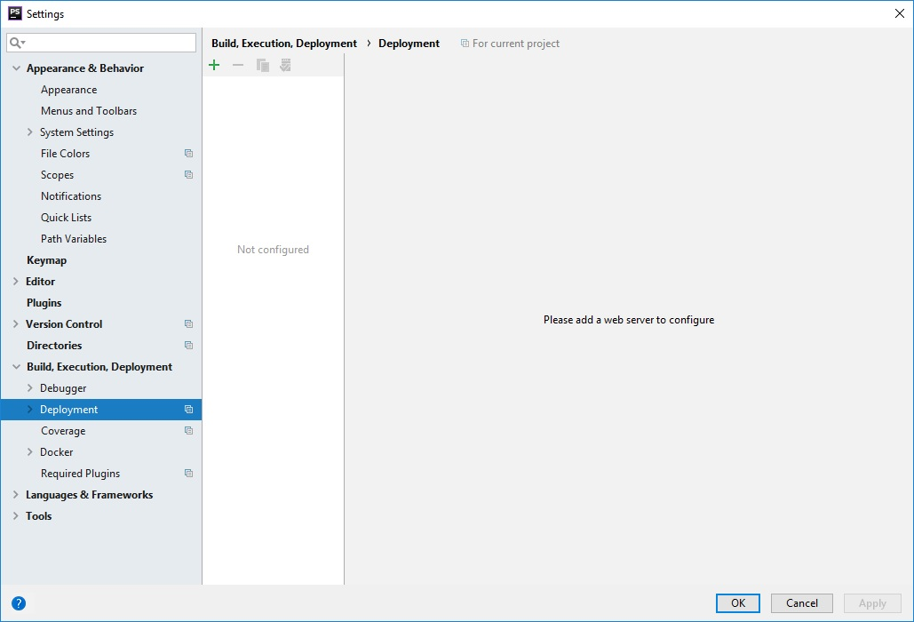
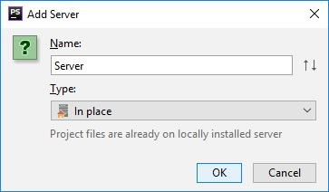
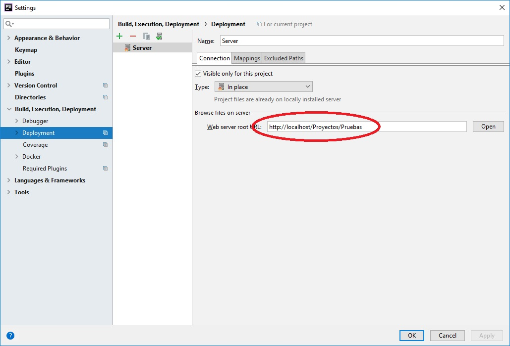
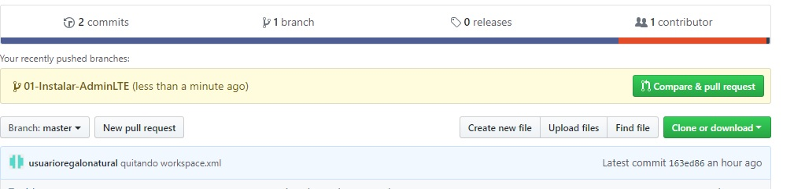

# Información manejo Laravel

### Creación de un nuevo proyecto
Para la creación de un nuevo proyecto, debemos situarnos en la ruta elegida, esta debe ser la ruta padre donde se generará el nuevo poryecto y utilizar composer
```
composer create-project laravel/laravel pru01 "5.7.*"
```

Despues creamos una bbdd en mysql, por ejemplo <code>pruebas</code>

Abrimos el proyecto y en el archivo <code>.env</code> sustiuimos los valores para conectar a la bbdd
```
DB_DATABASE=prueba
DB_USERNAME=root
DB_PASSWORD=xxxxx
```
Seguidamente configuramos IntelliJ para poder ejecutar en local.




### Generación de la info de BBDD
Para asegurarno que no aparece el error:
```
PDOException::("SQLSTATE[42000]: Syntax error or access violation: 1071 Specified key was too long; max key length is 767 bytes")
```
tenemos que modificar el siguiente archivo incluyendo lo siguiente:
<code>app/providers/AppServiceProvider.php</code>

```php
<?php

namespace App\Providers;

use Illuminate\Support\ServiceProvider;
use Illuminate\Support\Facades\Schema; <--añadir esta linea

class AppServiceProvider extends ServiceProvider
{
    /**
     * Bootstrap any application services.
     *
     * @return void
     */
    public function boot()
    {
        Schema::defaultStringLength(191); <--añadir esta linea
    }

    /**
     * Register any application services.
     *
     * @return void
     */
    public function register()
    {
        //
    }
}
```

después en el directorio del proyecto, escribimos:
```bash
php artisan migrate
```

### Generar las opciones de autentificación
Para ello en el directorio del proyecto escribiremos:
```
php artisan make:auth
```

## Subir a Github el proyecto
En el directorio local, inicializaremos GIT
```
H:\SERVIDOR-LOCAL\Ampps\www\Proyectos\gestionv3>git init
Initialized empty Git repository in H:/SERVIDOR-LOCAL/Ampps/www/Proyectos/gestionv3/.git/

H:\SERVIDOR-LOCAL\Ampps\www\Proyectos\gestionv3>
```
Después crearemos un nuevo repositorio en github (gestionv3)

Antes de subirlo, necesitamos modificar el fichero <code>.gitignore</code> para que incluya la carpeta /vendor en la sincronización:
```
/node_modules
/public/hot
/public/storage
/storage/*.key
#/vendor <-- Comentar o quitar esta línea
.env
.phpunit.result.cache
Homestead.json
Homestead.yaml
npm-debug.log
yarn-error.log
```
y en el directorio local lo subiremos:
```
git remote add origin https://github.com/usuarioregalonatural/gestionv3.git
git add *
git commit -m "Commit Inicial"
git push -u origin master
```
## Sincronización en el Server
Nos movemos al servidor, y en el directorio padre donde vayamos a crearlo, lo clonamos:
```
[root@vicsoft Gestion]# git clone https://github.com/usuarioregalonatural/gestionv3.git
```
Esto nos creará la carpeta con el proyecto.

Acto seguido creamos en link simbólico en la carpeta de acceso web del servidor hacia donde tenemos nuestro proyecto:
```bash
[root@vicsoft html]# pwd
/var/www/html
[root@vicsoft html]# mv gestion 20181225-gestion
[root@vicsoft html]# ln -s /home/webs/Gestion/gestionv3/public gestion
```
Después le asignamos permisos y propietarios a la carpeta:
 ```bash
[root@vicsoft gestionv3]# chown -R www-data:apache *
[root@vicsoft gestionv3]# chmod -R 777 *
```

### Configurar Laravel en Producción
Primer paso copiar el fichero de entorno ejemplo como final
```bash
cp .env.example .env
```
Luego editamos el fichero <code>.env</code> y modificamos lo siguiente:
```bash
APP_ENV=production <-- esto
APP_DEBUG=false <-- esto
APP_KEY=SomeRandomString (esto se genera luego)

DB_HOST=localhost <-- esto
DB_DATABASE=gestionatural <-- esto
DB_USERNAME=root <-- esto
DB_PASSWORD=XXXXXXXXX <-- esto
```

Una vez realizadas las modificaciones, guardaremos y generaremos la APP_KEY

```bash
php artisan key:generate
```
luego ir al fichero <code>config/app.php</code> y confirmar que la url es la adecuada

### Configurar Cache
Es bueno recompilar los ficheros de configuración para que el cacheo se haga bien
Dentro del directorio de la aplicación (*/home/webs/gestion-natural/Gestion-Ralucart*)

```bash
php artisan config:cache
```
Después debe aparece un mensaje como este:
```bash
[root@vicsoft Gestion-Ralucart]# php artisan config:cache
Configuration cache cleared!
Configuration cached successfully!
```

### Migrar la base de datos
A continuación procederemos a migrar las tablas a la bbdd de producción:
 ```bash
[root@vicsoft gesralv1]# php artisan migrate
**************************************
*     Application In Production!     *
**************************************

 Do you really wish to run this command? (yes/no) [no]:
 > yes

Migration table created successfully.
Migrating: 2014_10_12_000000_create_users_table
Migrated:  2014_10_12_000000_create_users_table
Migrating: 2014_10_12_100000_create_password_resets_table
Migrated:  2014_10_12_100000_create_password_resets_table
[root@vicsoft gesralv1]#
 ```
 Con esto ya tendremos lista la web en su forma operativa de autentificación básica.
 
 **En adelante todo lo que hagamos será en nuevas ramas de git verificando que funciona.**
 
 
 ## Instalar AdminLTE
 Esta es una plantilla para Laravel que utilizaremos.
 
 En principio vamos a hacer la instalación en local para ello en IntelliJ.
 Lo primero será crear una nueva rama, una vez creada y situandonos en ella, en el terminal escribiremos:
 ```
 composer require jeroennoten/laravel-adminlte
 ```
 si todo ha ido bien, configuraremos el archivo **config/app.php** para incluir lo siguiente:
 ```php
 'providers' => [

	....

	JeroenNoten\LaravelAdminLte\ServiceProvider::class,

],
 
```
una vez modificado ejecutaremos:
```bash
php artisan vendor:publish --provider="JeroenNoten\LaravelAdminLte\ServiceProvider" --tag=assets
```
y luego lo siguiente:
```php
php artisan vendor:publish --provider="JeroenNoten\LaravelAdminLte\ServiceProvider" --tag=config
```

Teoricamente ya está configurado AdminLTE, ahora vamos a ver si es así:

#### Comprobación de AdminLTE
Nos vamos al archivo <code>routes/web.php</code> y lo editamos indicando la siguiente línea:
```php
Route::get('home', function () {return view('home');});

```
Es necesario que exista este archivo <code>views/home.blade.php</code> que será al que redireccionará la ruta.

Editaremos el archivo <code>views/home.blade.php</code> para cambiar layouts.app por el de AdminLTE e indicaremos un Dashboard:
 ```php
 @extends('adminlte::page')


@section('title', 'Dashboard')


@section('content_header')

    <h1>Ultima Semana</h1>
    <!--    <link href="css/bootstrap.min.css" rel="stylesheet"> -->
@stop


@section('content')


<!--    <div class="alert alert-danger alert-dismissible">
        <button type="button" class="close" data-dismiss="alert" aria-hidden="true">&times;</button>
        <h5><i class="icon fa fa-ban"></i> Alert!</h5>
        Danger alert preview. This alert is dismissable. A wonderful serenity has taken possession of my
        entire
        soul, like these sweet mornings of spring which I enjoy with my whole heart.
    </div>
    <div class="alert alert-info alert-dismissible">
        <button type="button" class="close" data-dismiss="alert" aria-hidden="true">&times;</button>
        <h5><i class="icon fa fa-info"></i> Alert!</h5>
        Info alert preview. This alert is dismissable.
    </div>
-->
    <!-- Small Box (Stat card) -->
    <h5 class="mb-2 mt-4"><b></b></h5>
    <div class="row">
        <!-- /.col -->
        <div class="col-lg-3 col-6">
            <!-- small card -->
            <div class="small-box bg-info">
                <div class="inner">
                    <h3>150</h3>

                    <p>Nuevos Pedidos</p>
                </div>
                <div class="icon">
                    <i class="fa fa-shopping-cart"></i>
                </div>
                <a href="#" class="small-box-footer">
                    More info <i class="fa fa-arrow-circle-right"></i>
                </a>
            </div>
        </div>
       <!-- /.col -->
        <!-- /.col -->
        <div class="col-lg-3 col-6">
            <!-- small card -->
            <div class="small-box bg-success">
                <div class="inner">
                    <h3>2.330,43 </h3>

                    <p>Ingresos</p>
                </div>
                <div class="icon">
                    <i class="ion ion-stats-bars"></i>
                </div>
                <a href="#" class="small-box-footer">
                    More info <i class="fa fa-arrow-circle-right"></i>
                </a>
            </div>
        </div>
        <!-- /.col -->
        <!-- /.col -->
        <div class="col-lg-3 col-6">
            <!-- small card -->
            <div class="small-box bg-danger">
                <div class="inner">
                    <h3>-876,55 </h3>

                    <p>Gastos</p>
                </div>
                <div class="icon">
                    <i class="ion ion-social-euro"></i>
                </div>
                <a href="#" class="small-box-footer">
                    More info <i class="fa fa-arrow-circle-right"></i>
                </a>
            </div>
        </div>
        <!-- /.col -->
    </div>
<!-- row-->
    <div class="container-fluid">
        <h5 class="mb-2"></h5>
        <div class="row">

        <div>
            <!-- col-->
            <div class="col-md-3 col-sm-6 col-12">
                <div class="info-box">
                    <span class="info-box-icon bg-info" ><i class="fa fa-american-sign-language-interpreting"></i>
                     <!--   <i class="fa fa-caret-square-o-right"></i> -->
                    </span>

                    <div class="info-box-content" >
                        <span class="info-box-text">Pedidos pendientes preparar</span>
                        <span class="info-box-number">12</span>
                    </div>
                    <!-- /.info-box-content -->
                </div>
                <!-- /.info-box -->
            </div>
            <!-- col-->
            <div class="col-md-3 col-sm-6 col-12">
                <div class="info-box">
                    <span class="info-box-icon bg-success" ><i class="fa fa-ship"></i>
                        <!--   <i class="fa fa-caret-square-o-right"></i> -->
                    </span>

                    <div class="info-box-content" >
                        <span class="info-box-text">Pedidos pendientes enviar</span>
                        <span class="info-box-number">3</span>
                    </div>
                    <!-- /.info-box-content -->
                </div>
                <!-- /.info-box -->
            </div>
            <!-- col-->

        </div>

        </div>
        <!-- /.info-box-content -->
    </div>
    <!-- /.info-box -->
    </div>
    <!-- /.col -->
    </div>
    <!-- /.row -->
@stop


@section('css')

    <link rel="stylesheet" href="/css/admin_custom.css">

@stop


@section('js')

    <script> console.log('Hi!'); </script>
    <!--   <script src="js/bootstrap.min.js"></script> -->
@stop


```
una vez registrados, debería llevarnos a la pantalla con formato AdminLTE y su dashboard

#### Actualización en Servidor
Ahora actualizaremos en github en el servidor
* en IntelliJ haremos un <code>git add * </code> para incluir los nuevos archivos y cambios.
* Luego haremos **commit** y **push** con lo que se quedará la nueva rama incluida en github y pendiente de pull request. Esperamos a hacer el pull request.

* En el server haremos un pull para actualizar con los nuevos ficheros:
```bash 
[root@vicsoft gesralv1]# git pull
[root@vicsoft gesralv1]# git pull
remote: Enumerating objects: 207, done.
remote: Counting objects: 100% (207/207), done.
remote: Compressing objects: 100% (103/103), done.
remote: Total 187 (delta 54), reused 187 (delta 54), pack-reused 0
Receiving objects: 100% (187/187), 1.47 MiB | 0 bytes/s, done.
Resolving deltas: 100% (54/54), completed with 19 local objects.
From https://github.com/usuarioregalonatural/gesralv1
 * [new branch]      01-Instalar-AdminLTE -> origin/01-Instalar-AdminLTE
Already up-to-date.
```
- Nos creará la nueva rama en el servidor y pasaremos a cambiar a esta rama:
```bash
[root@vicsoft gesralv1]# git checkout 01-Instalar-AdminLTE
Branch 01-Instalar-AdminLTE set up to track remote branch 01-Instalar-AdminLTE from origin.
Switched to a new branch '01-Instalar-AdminLTE'
```
Ahora vamos a dar permisos y propietarios a todo para que se incluya lo nuevo:
```bash
[root@vicsoft gesralv1]# chown -R www-data:apache *
[root@vicsoft gesralv1]# chmod -R 777 *
```

Probablemente en la rama nueva dentro del servidor tenemos que actualizar lo nuevo:
```bash
git add *
git commit -m "actualizacion"
php artisan config:cache
php artisan config:clear
```
ahora debería mostrarse el dashboard de home correctamente estando en el server en la rama nueva y podremos hacer el pull request en git hub para mergear la rama dentro de master
)

## Personalización AdminLTE (home)
A continuación vamos a personalizar los menús, gráficos, etc.

* Crearemos una carpeta nueva en local
```
public/img
```
para subir las imagenes que utilicemos.

Subiremos la imagen de logo. 

Luego en el fichero <code>resources/views/welcome.blade.php</code> incluiremos la imagen
```php
    <body>
        <div class="flex-center position-ref full-height">
            @if (Route::has('login'))
                <div class="top-right links">
                    @auth
                        <a href="{{ url('/home') }}">Home</a>
                    @else
                        <a href="{{ route('login') }}">Login</a>

                     @endauth
                </div>
            @endif
--> añadimos este bloque
            <div class="content">
                <div class="title m-b-md">
                     
                </div>                                            
                <div class="content">                                              
                    <div class="title m-b-md">                      
                        Gestión                                                   
                    </div>                                                        
        --> hasta aquí

            </div>
        </div>
        </div>
    </body>
```
Luego sustituimos el menú en el archivo <code>config/adminlte.php</code>
```php
'menu' => [
        'ACCESO RAPIDO',
        [
            'text'        => 'Pedidos Clientes',
            'url'         => 'clientes/pedidos',
            'icon'        => 'shopping-cart',
            'icon_color'  => 'green',
            // 'label'       => 4,
            'label_color' => 'success',
        ],
        [
            'text'        => 'Compras Proveedores',
            'url'         => 'proveedores/compras',
            'icon'        => 'credit-card',
            'icon_color'  => 'blue',

            // 'label'       => 4,
            'label_color' => 'success',
        ],
        'CLIENTES',
        [
            'text'        => 'Nuevo',
            'url'         => 'nuevo_cliente',
            'icon'        => 'user',
            'icon_color'  => 'aqua',
            'label_color' => 'success',
        ],
        [
            'text'        => 'Buscar',
            'url'         => 'ver_clientes',
            'icon'        => 'search',
            'label_color' => 'success',
        ],
        [
            'text'        => 'Informes',
            'url'         => 'clientes/informes',
            'icon'        => 'list-alt',
            'label_color' => 'success',
        ],
        'PROVEEDORES',
        [
            'text'        => 'Nuevo',
            'url'         => 'proveedores',
            'icon'        => 'briefcase',
            'icon_color'  => 'yellow',
            'label_color' => 'success',
        ],
        [
            'text'        => 'Buscar',
            'url'         => 'proveedores/busqueda',
            'icon'        => 'search',
            'label_color' => 'success',
        ],
        [
            'text'        => 'Informes',
            'url'         => 'proveedores/informes',
            'icon'        => 'list-alt',
            'label_color' => 'success',
        ],
 ],

    /*
    |--------------------------------------------------------------------------
    | Menu Filters
    |--------------------------------------------------------------------------
```
    
También podemos cambiar en el mismo archivo los títulos:
```php
    'logo' => '<b>Gestion</b> Raluca Art',

    'logo_mini' => '<b>Ra</b>lu',

```
Antes de subir esta rama, actualizaremos en GIT, viendo el status
```php
H:\SERVIDOR-LOCAL\Ampps\www\Proyectos\gesralv1>git status
On branch 02-Personalizacion-AdminLTE
Changes not staged for commit:
  (use "git add <file>..." to update what will be committed)
  (use "git checkout -- <file>..." to discard changes in working directory)

        modified:   config/adminlte.php
        modified:   resources/views/welcome.blade.php

Untracked files:
  (use "git add <file>..." to include in what will be committed)

        public/img/

no changes added to commit (use "git add" and/or "git commit -a")

```

luego añadiendo lo nuevo:
```php 
H:\SERVIDOR-LOCAL\Ampps\www\Proyectos\gesralv1>git add *
```
y haciendo **commit** y **push**


Ahora, una vez incluida la rama en github, comprobaremos en el servidor que todo funciona antes de hacer el pullrequest.

Dentro de la rama master en el serividor:
```bash
[root@vicsoft gesralv1]# git branch
  01-Instalar-AdminLTE
* master
[root@vicsoft gesralv1]#
 ```
 haremos un git pull y nos dirá que existe una nueva rama:
  ```bash
  [root@vicsoft gesralv1]# git pull
remote: Enumerating objects: 17, done.
remote: Counting objects: 100% (17/17), done.
remote: Compressing objects: 100% (3/3), done.
remote: Total 10 (delta 7), reused 10 (delta 7), pack-reused 0
Unpacking objects: 100% (10/10), done.
From https://github.com/usuarioregalonatural/gesralv1
 * [new branch]      02-Personalizacion-AdminLTE -> origin/02-Personalizacion-AdminLTE
Already up-to-date.
[root@vicsoft gesralv1]#
```
Nos cambiaremos a la nueva rama:
```bash
[root@vicsoft gesralv1]# git checkout 02-Personalizacion-AdminLTE
Branch 02-Personalizacion-AdminLTE set up to track remote branch 02-Personalizacion-AdminLTE from origin.
Switched to a new branch '02-Personalizacion-AdminLTE'
[root@vicsoft gesralv1]#
```
y verificaremos en la web que todo está Ok, si es así, procederemos a:
- Hacer el pullrequest en GitHub con lo que añadiremos la nueva rama a master
- Cambiaremos en el servidor a la rama master y haremos un pull para actualizar lo nuevo.

```bash
[root@vicsoft gesralv1]# git checkout master
Switched to branch 'master'
Your branch is ahead of 'origin/master' by 2 commits.
  (use "git push" to publish your local commits)
[root@vicsoft gesralv1]# git branch
  01-Instalar-AdminLTE
  02-Personalizacion-AdminLTE
* master
 ```
 ```bash
 [root@vicsoft gesralv1]# git pull
remote: Enumerating objects: 1, done.
remote: Counting objects: 100% (1/1), done.
remote: Total 1 (delta 0), reused 0 (delta 0), pack-reused 0
Unpacking objects: 100% (1/1), done.
From https://github.com/usuarioregalonatural/gesralv1
   3b2f4b8..60797bb  master     -> origin/master
Auto-merging resources/views/welcome.blade.php
Merge made by the 'recursive' strategy.
 config/adminlte.php                       | 103 +++++++++++++++++++++++++++++++++++++++++++------------------------------------------------------------
 public/img/raluca-art-logo-1537553801.jpg | Bin 0 -> 7553 bytes
 resources/views/welcome.blade.php         |  14 +++++---------
 3 files changed, 48 insertions(+), 69 deletions(-)
 create mode 100644 public/img/raluca-art-logo-1537553801.jpg
[root@vicsoft gesralv1]#
```
# Creación de entidades CRUD

## Altas de Proveedores

###Crear la tabla de proveedores en la parte de migraciones
*El nombre de tabla tiene que ser en minúsculas y en plural*
```
php artisan make:migration create_providers_table --create=providers
```
Esto creará el fichero <code>2018_12_24_155744_create_providers_table.php</code> en la siguiente ruta:

```
database/migrations
```
Siguiente paso editar el fichero e incluir los campos necesarios en la tabla:
```php
    public function up()
    {
       Schema::create('providers', function (Blueprint $table) {
            $table->increments('id');
            $table->string('cod_proveedor');    <--nueva
            $table->string('nombre');           <--nueva
            $table->string('direccion');        <--nueva
            $table->string('telefono');         <--nueva
            $table->string('email');            <--nueva
            $table->string('web');              <--nueva
            $table->timestamps();
        });
    }

```
Después ejecutar la migración desde la terminal
```
php artisan migrate
```
* Hay que tener en cuenta que también habrá que ejecutar la migración en Producción.

### Crear el modelo Proveedor
El nombre del modelo debe ser en singular y con la primera letra en mayúsculas.
```
php artisan make:model Provider
```
Después de ejecutarlo, deberá aprecer el siguiente fichero <code>app/Provider.php</code>

Tendría este contenido:
```php
<?php

namespace App;

use Illuminate\Database\Eloquent\Model;

class Provider extends Model
{
    //
}

```
Si quisieramos que la tabla Proveedores tuviera relación, por ejemplo, con CategoriaProveedor tendríamos que añadir a la clase lo siguiente:
```php
return $this->belongTo('App\CategoriaProveedor');
```

quedando así:

```php
<?php

namespace App;

use Illuminate\Database\Eloquent\Model;

class Cliente extends Model
{
   return $this->belongsTo('App\CategoriaProveedor');
}

```
Para mostrar un atributo, podríamos añadir lo siguiente dentro de la clase:
```php
public function getNombre()
{
    return $this->nombre;
}
```
### Creación del controlador de Proveedores 
Podemos crear un controlador para cada entidad con el comando:
```php
php artisan make:controller ProvidersController --resource
```
con el parámetro <code>--resource</code> conseguimos que nos cree acciones Restful (crear, editar, etc.)
Esto nos creará un archivo eh <code>Http/Controllers/ProvidersControllers.php</code> que contendrá las estructuras de control.


### Validaciones Request
Esto nos permite realizar validaciones previas a nivel de campo antes de enviar a la BBDD

Para crear una nueva request ejecutamos el comando:
```bash
php artisan make:request ProvidersFormRequest
```

Nos creará en la carpeta Http/Request un fichero para realizar las validaciones.

Dentro de este archivo tendremos que cambiar a TRUE el retorno de la función authorize.
```php
    public function authorize()
    {
        return true; <-- aquí
    }

```
En la parte de reglas (rules) podemos indicar nuevas condiciones de validación:
```php
    public function rules()
    {
        return [
            'nombre' => 'required|min:3',
            //
        ];
    }
```
En este ejemplo, validamos que sea obligatorio informar un dato (required) y que tenga una longitud mínima de 3 caracteres.

Laravel nos exige referenciar una clase en el archivo <code>ProvidersController.php</code>
```php
 <?php
 
 namespace App\Http\Controllers;
 
 use Illuminate\Http\Request;
 use App\Http\Requests\ProvidersFormRequest; <-- Esta linea
 
 class ProveedoresController extends Controller
 {
...
```
### Creación de rutas de modelo
Esto nos permite crear urls amigables.
Debemos crear las view para proveedores. En <code>Resources/views</code> añadiremos una carpeta providers y dentro de ella un archivo php que se llame <code>altaproviders.blade.php</code>. Este archivo nos servirá para guardar el formulario de alta de proveedores. 


Después nos iremos al fichero <code>routes/web.php</code> y lo editaremos para incluir las nuevas rutas.
En web.php tendremos dos rutas para, por ejemplo, proveedores:
```php
Route::get('/providers', 'ProvidersController@create');
Route::post('/providers', 'ProvidersController@store');
```
La primera nos dirigirá cuando se introduzca en el explorador "/providers" a la función create del controler <code>ProvidersController.php</code>

La segunda nos dirigirá a la función create del controler <code>ProvidersController.php</code>


En la **primera** nos redirigirá desde <code>ProvidersController.php</code> a la vista de alta donde nos mostrará el formulario de alta 
```php
    public function create()
    {
        return view('providers.altaprovider');
    }
```

En la **segunda** nos redirigirá desde <code>ProvidersController.php</code> al almacenamiento de los datos
```php
    public function store()
    {
        return view('providers.altaprovider');
    }
```
* Ahora es buen momento para referenciar en el menú de AmdinLTE la opción Proveedores hacia la ruta indicada en web.php
Sustituimos el menú en el archivo <code>config/adminlte.php</code>
```php
        'PROVEEDORES',
        [
            'text'        => 'Nuevo',
            'url'         => 'providers', <-- aqui
            'icon'        => 'briefcase',
            'icon_color'  => 'yellow',
            'label_color' => 'success',
        ],
```
### Creando la página de Proveedores
Lo primero que haremos es modificar el archivo <code>altaproviders.blade.php</code> para ponerle una estructura de blade e incluirle la referencia que extienda la plantilla de AdminLTE
```php
@extends('adminlte::page')

@section('content')

    // Aquí irá el contenido de la página (formularios, botones, imagenes, etc)
    
@endsection
```

Ahora vamos a actualizar con el formulario de Proveedores para poder enviar peticiones POST y con los nombres de los campos en los objetos (estos nombres deben coincidir con los nombres de los campos de la bbdd.
```html
           <form class="form-horizontal" method="POST"> <--se añade post para la función de altas
                <div class="card-body">
                    <div class="form-group">
                        <label for="nombre" class="col-sm-2 control-label">Nombre:</label>

                        <div class="col-sm-10">
                            <input type="text" class="form-control" id="nombre" placeholder="nombre" name="nombre"> <--se añade name
                        </div>
                    </div>
                    <div class="form-group">
                        <label for="direccion" class="col-sm-2 control-label">Dirección:</label>

                        <div class="col-sm-10">
                            <input type="text" class="form-control" id="direccion" placeholder="direccion" name="direccion"> <--se añade name
                        </div>
                    </div>
```

Ojo, no funcionará tal cual, hay que añadir en el formulario un campo oculto **token** 
```html
            <!-- form start -->
            <form class="form-horizontal" method="POST">
                <input type="hidden" name="_token" value="{!! csrf_token() !!}">  <-- Esta linea
                <div class="card-body">
 
```

También es importante modificar en el controller <code>ProvidersController.php</code> para que devuelva todo lo que haya en el formulario:
```php
  public function store(Request $request)
    {
        return $request->all();
    }
```
una vez realizado, tras recargar la web y enviar la info debería aparecernos la info a enviar:
```json
{"_token":"8QazdyTPHnnJjxosseEoJM3XXDnlkMPkgyYtdpQy","nombre":"Pepe","direccion":"dfljdsl"}
```

##### Ahora aplicaremos las validaciones para los Request:
Donde reside el formulario "altaprovider.blade.php"  en la parte del **form**  añadiremos un *@foreach-error* para controlarlo.
```html
            <!-- form start -->
            <form class="form-horizontal" method="POST">
            
                @foreach ($errors->all() as $error)             <--nueva
                <p class="alert alert-danger">{{ $error }}</p>  <--nueva
                @endforeach                                     <--nueva
                
                <input type="hidden" name="_token" value="{!! csrf_token() !!}">  <-- Esta linea
                <div class="card-body">
 
```
Es **importantísimo** que en el archivo <code>ProvidersController.php</code> en la función store el request sea el ProvidersFormRequest que hemos deifinido antes:

```php
    public function store(ProvidersFormRequest $request)
    {
        return $request->all();
    }
```

#### Ya es hora de subir esto a GitHub
Ahora ya podríamos subir los cambios en este rama a github

```bash
H:\SERVIDOR-LOCAL\Ampps\www\Proyectos\gesralv1>git status
On branch 03-CRUD-Proveedores
Changes to be committed:
  (use "git reset HEAD <file>..." to unstage)

        new file:   resources/views/providers/altaprovider.blade.php

Changes not staged for commit:
  (use "git add <file>..." to update what will be committed)
  (use "git checkout -- <file>..." to discard changes in working directory)

        modified:   config/adminlte.php
        modified:   resources/views/providers/altaprovider.blade.php
        modified:   routes/web.php
        modified:   vendor/composer/autoload_classmap.php
        modified:   vendor/composer/autoload_psr4.php
        modified:   vendor/composer/autoload_static.php

Untracked files:
  (use "git add <file>..." to include in what will be committed)

        app/Http/Controllers/ProvidersController.php
        app/Http/Requests/
        app/Provider.php
        database/migrations/2018_12_25_181237_create_providers_table.php

```
añadimos los archivos nuevos con <code>git add *</code> y vamos con el commit y el push

### Interactuando Proveedores con BBDD
Aquí vamos a empezar a guardar los datos del formulario de proveedores en la bbdd.

En primer lugar nos vamos al controller. En este caso nos vamos a <code>app/Http/Controllers/ProvidersController.php</code>

e incluimos la referencia a la clase Provider.
```php
<?php

namespace App\Http\Controllers;

use Illuminate\Http\Request;
use App\Http\Requests\ProvidersFormRequest;
use App\Provider;                              <--Esta linea

class ProvidersController extends Controller
...
``` 
Después nos vamos a la función <code>store</code> y añadimos el siguiente contenido:
```php
   public function store(ProvidersFormRequest $request)
    {
        $provider = new Provider(array(
            'cod_proveedor' => $request->get('cod_proveedor'),
            'nombre' => $request->get('nombre'),
            'direccion' => $request->get('direccion'),
            'telefono' => $request->get('teleofno'),
            'email' => $request->get('email'),
            'web' => $request->get('web')
        ));
        $provider->save();
        return redirect('providers')->with('status','El proveedor has sido dado de alta.');

    }
``` 
Esto aún no funcionará todavía, debemos configurar para evitar las inyección de código. Para ello nos iremos a objeto Proveedor (app/Provider.php) y

```php
 <?php
 
 namespace App;
 
 use Illuminate\Database\Eloquent\Model;
 
 class Provider extends Model
 {
 
     protected $fillable =['cod_proveedor','nombre','direccion', 'telefono','email','web']; <-- esta linea

```
Si queremos que muestre que ha ido ok el alta del proveedor, tendremos que incluir en la vista <code>altaprovider.blade.php</code> lo siguiente:

```php
@extends('adminlte::page')

@section('content')
--> desde aquí
    @if (session('status'))
        <div class="alert alert-success">
            {{ session('status') }}
        </div>
    @endif
--> hasta aquí
<div class="row">
        <div class="col-md-4">
```
**Con esto damos por finalizada la incoroporación de las alta de proveedores inicial**


## Mostrar Proveedores

Ahora vamos a comenzar trabajando para mostrar los proveedores que tenemos.

Para ello, en local, nos crearemos una nueva rama "04-Mostrar-Proveedores" y trabajaremos sobre ella.

Lo primero añadiremos la ruta en el archivo <code>routes/web.php</code>

```php
Route::get('/alta-providers', 'ProvidersController@create');
Route::post('/alta-providers', 'ProvidersController@store');
Route::get('/providers', 'ProvidersController@index'); <-- este es el puntero nuevo para mostrar
 ```
 **Ojo**, es muy importante que sea con el método GET para traernos los datos.
 
 Se puede observar que hemos tenido que cambiar las dos anteriores rutas para separar las altas del listado. Obviamente se ha modificado el menu en /config/adminlte.php para que apunte correctamente.
 
 ```php
        'PROVEEDORES',
        [
            'text'        => 'Listado',
            'url'         => 'providers',
            'icon'        => 'briefcase',
            'icon_color'  => 'yellow',
            'label_color' => 'success',
        ],
        [
            'text'        => 'Nuevo',
            'url'         => 'alta-providers',
            'icon'        => 'briefcase',
            'icon_color'  => 'yellow',
            'label_color' => 'success',
```            
También ha sido necesario modificar el controlador de providers para que redireccione a alta-providers cuando salva los datos
```php
   public function store(ProvidersFormRequest $request)
    {
        $provider = new Provider(array(
            'cod_proveedor' => $request->get('cod_proveedor'),
            'nombre' => $request->get('nombre'),
            'direccion' => $request->get('direccion'),
            'telefono' => $request->get('telefono'),
            'email' => $request->get('email'),
            'web' => $request->get('web')
        ));
        $provider->save();
        return redirect('alta-providers')->with('status','El proveedor has sido dado de alta.');
    }
```
Vale, ahora vamos a cambiar el controlardor de providers para que redirija a la vista <code>views/providers/index</code> dentro de la  para mostrar los datos
```php
   public function index()
    {
       $providers= Provider::all();
       return view('providers.index',compact('providers'));
    }
```
<code>compact</code> convierte el resultado en un array que la pasamos a la view.

El siguiente paso es crear la view index de providers para el listado. 

Creamos el archivo <code>views/providers/index.blade.php</code> y le agregamos el siguiente contenido:
 ```php
 @extends('adminlte::page')
@section('content')

    <div class="container col-md8 col-md-offset-2">
        <div class="panel panel-default">
            <div class="panel-heading">
                <h2>Proveedores</h2>
            </div>
            @if ($providers->isEmpty())
                <p>No hay proveedores almacenados</p>
            @else
                <table class="table">
                    <thead>
                        <tr>
                            <th>Codigo</th>
                            <th>Nombre</th>
                            <th>Direccion</th>
                            <th>Telefono</th>
                            <th>Email</th>
                            <th>Web</th>
                        </tr>
                    </thead>
                    <tbody>
                        @foreach($providers as $provider)
                            <tr>
                                <td>{!! $provider->cod_proveedor !!}</td>
                                <td>{!! $provider->nombre !!}</td>
                                <td>{!! $provider->direccion !!}</td>
                                <td>{!! $provider->telefono !!}</td>
                                <td>{!! $provider->email !!}</td>
                                <td>{!! $provider->web !!}</td>
                            </tr>
                        @endforeach
                    </tbody>

                </table>
             @endif
      </div>
  </div>

@endsection
``` 
Hasta aquí la vista de la lista de proveedores.

## Mostrar un proveedor

Primer paso, vamos a la definición de rutas <code>routes/web.php</code> e incluimos la nueva ruta para mostrar un proveedor;
```php
<?php

/*
|--------------------------------------------------------------------------
| Web Routes
|--------------------------------------------------------------------------
|
| Here is where you can register web routes for your application. These
| routes are loaded by the RouteServiceProvider within a group which
| contains the "web" middleware group. Now create something great!
|
*/

Route::get('/', function () {
    return view('welcome');
});

Auth::routes();

//Route::get('/home', 'HomeController@index')->name('home');

Route::get('home', function () {return view('home');});

Route::get('/alta-providers', 'ProvidersController@create');
Route::post('/alta-providers', 'ProvidersController@store');
Route::get('/providers', 'ProvidersController@index');
Route::get('/providers/{id?}', 'ProvidersController@show'); <-- esta
```

Siguiente paso añadir en <code>app/Http/Controllers/ProvidersController.php</code> en la función **show** el código necesario:
```php
   public function show($id)
    {
        $provider= Provider::whereid($id)->firstOrFail();
        return view('providers.show',compact('provider'));
        
    }
```
A continuación creamos la vista <code>providers/show.php</code> con el siguiente contenido:
 ```php
 @extends('adminlte::page')
@section('content')

    <div class="container col-md8 col-md-offset-2">
        <div class="panel panel-default">
            <div class="panel-heading">
                <h2>Proveedor: <strong>{!! $provider->nombre !!}</strong></h2>
            </div>
            <div class="well well bs-component">
                <div class="content">
                     <p><strong>Codigo: </strong>{!! $provider->cod_proveedor !!}</p>
                    <p><strong>Dirección: </strong>{!! $provider->direccion !!}</p>
                </div>
                <a href="#" class="btn btn-info">Editar</a>
                <a href="#" class="btn btn-info">Borrar</a>
            </div>
        </div>
    </div>

@endsection
 ```
 ## Enlazar el listado con mostrar Proveedor
 Para esto utilizaremos **helpers** de Laravel. No iremos a la view donde aparece el listado de los proveedores <code>views/providers/index.blade.php</code> y en ella modificaremos dentro del bloque @foreach uno de los campos mostrados para que enlace con la vista de un proveedor concreto:
 ```php
 @foreach($providers as $provider)
    <tr>
       <td>{!! $provider->cod_proveedor !!}</td>
       <td><a href="{!! action('ProvidersController@show', $provider->id) !!}" >{!! $provider->nombre !!}</a></td>
       <td>{!! $provider->direccion !!}</td>
       <td>{!! $provider->telefono !!}</td>
       <td>{!! $provider->email !!}</td>
       <td>{!! $provider->web !!}</td>
   </tr>
@endforeach
 ```
 ## Editar Proveedores
 * Primer paso, añadir una nueva ruta de edición a <code>routes/web.php</code>
 ```php
 Route::get('/alta-providers', 'ProvidersController@create');
Route::post('/alta-providers', 'ProvidersController@store');
Route::get('/providers', 'ProvidersController@index');
Route::get('/providers/{id?}', 'ProvidersController@show');
Route::get('/providers/{id?}/edit', 'ProvidersController@edit'); <-- esta línea
 ```
Siguiente paso ir al controlador <code>app/Http/Controllers/ProvidersController.php</code> y le añadimos el siguiente contenido:
```php
   public function edit($id)
    {
        $provider= Provider::whereid($id)->firstOrFail();
        return view('providers.edit',compact('provider'));
    }
```

A continuación vamos a crear la vista para editar <code>resources/views/providers/edit.blade.php</code> con un contenido similar al de la creación de proveedores:
 ```php
@extends('adminlte::page')

@section('content')
    @if (session('status'))
        <div class="alert alert-success">
            {{ session('status') }}
        </div>
    @endif
    <div class="row">
        <div class="col-md-4">
            <div class="card">
                <div class="card-header">
                    <h3 class="card-title">
                       Editar Proveedor
                    </h3>
                    <div>
                        <!-- Formulario -->
                        <form class="form-horizontal" method="POST">
                            @foreach ($errors->all() as $error)
                                <p class="alert alert-danger">{{ $error }}</p>
                            @endforeach
                            <input type="hidden" name="_token" value="{!! csrf_token() !!}">
                            <div class="card-body">
                                <!-- Codigo -->
                                <div class="form-group">
                                    <label for="nombre" class="col-sm-2 control-label">Código:</label>

                                    <div class="col-sm-10">
                                        <input type="text" class="form-control" id="codigo" placeholder="codigo" name="cod_proveedor" value="{!! $provider->cod_proveedor !!}">
                                    </div>
                                </div>
                                <!-- Nombre -->
                                <div class="form-group">
                                    <label for="nombre" class="col-sm-2 control-label">Nombre:</label>

                                    <div class="col-sm-10">
                                        <input type="text" class="form-control" id="nombre" placeholder="nombre" name="nombre"  value="{!! $provider->nombre !!}">
                                    </div>
                                </div>
                                <!-- Direccion -->
                                <div class="form-group">
                                    <label for="direccion" class="col-sm-2 control-label">Dirección:</label>

                                    <div class="col-sm-10">
                                        <input type="text" class="form-control" id="direccion" placeholder="direccion" name="direccion"  value="{!! $provider->direccion !!}">
                                    </div>
                                </div>
                                <!---->
                                <!-- Telefono -->
                                <div class="form-group">
                                    <label for="direccion" class="col-sm-2 control-label">Telefono:</label>

                                    <div class="col-sm-10">
                                        <input type="text" class="form-control" id="telefono" placeholder="telefono" name="telefono"  value="{!! $provider->telefono !!}">
                                    </div>
                                </div>
                                <!---->
                                <!-- Email -->
                                <div class="form-group">
                                    <label for="direccion" class="col-sm-2 control-label">Email:</label>

                                    <div class="col-sm-10">
                                        <input type="text" class="form-control" id="email" placeholder="email" name="email"  value="{!! $provider->email !!}">
                                    </div>
                                </div>
                                <!---->
                                <!-- Web -->
                                <div class="form-group">
                                    <label for="direccion" class="col-sm-2 control-label">Web:</label>

                                    <div class="col-sm-10">
                                        <input type="text" class="form-control" id="web" placeholder="web" name="web"  value="{!! $provider->web !!}">
                                    </div>
                                </div>
                                <!---->
                            </div>
                            <!-- Botones-->
                            <div class="card-footer" align="center">
                                <button class="btn btn-default">Cancelar</button>
                                <button type="submit" class="btn btn-primary">Actualizar</button>
                            </div>

                        </form>

                        <!-- Formulario -->
                    </div>
                </div>
            </div>
        </div>
    </div>
@endsection

 ```
 Los cambios principales son los botones actualiza y cancelar y la parte en la que se muestran los valores de los campos en el formulario con **value="***valor***"** 
 
Siguiente paso es preparar el anterior boton **Editar** para que nos lleve aquí.

Para esto nos iremos a <code>resources/views/providers/show.php</code> y actualizaremos para que el botón ***Editar*** no lleve a la edición. Quedará así:
```php
@extends('adminlte::page')
@section('content')

    <div class="container col-md8 col-md-offset-2">
        <div class="panel panel-default">
            <div class="panel-heading">
                <h2>Proveedor: <strong>{!! $provider->nombre !!}</strong></h2>
            </div>
            <div class="well well bs-component">
                <div class="content">
                     <p><strong>Codigo: </strong>{!! $provider->cod_proveedor !!}</p>
                    <p><strong>Dirección: </strong>{!! $provider->direccion !!}</p>
                </div>
                 <a href="{!! action('ProvidersController@edit',$provider->id) !!}" class="btn btn-info">Editar</a>
                <a href="#" class="btn btn-info">Borrar</a>
            </div>
        </div>
    </div>

@endsection
```
